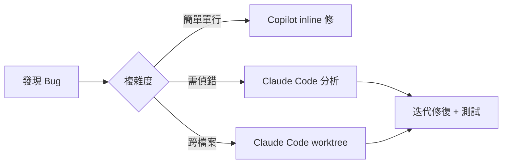

# AI Agent 使用策略詳解

> **目的**: 根據不同 AI Agent 的特性，選擇最有效率的工具組合。

---

## Agent 特性比較

### Claude Code (Anthropic)

**強項**:
- 終端機原生，深度整合 Git / LSP / 檔案系統
- 長上下文視窗（200K tokens，可擴展至 1M）
- 原生 Tool Use：Read / Edit / Bash / Grep / Glob / WebSearch
- Sub-agent 平行處理（Agent tool + worktree 隔離）
- 自動迭代修復（lint/type error → 自動修正循環）
- Slash commands 自訂工作流

**最佳使用場景**:
```
✅ 完整的 SDD-BDD-TDD 工作流（/specify → /implement）
✅ 跨多檔案重構與遷移
✅ 自動修復 lint/type 錯誤（迭代循環）
✅ 複雜規劃與設計（Plan-and-Execute）
✅ 多 Agent 平行處理（worktree 隔離）
```

**使用技巧**:
```bash
# 1. 善用 slash commands 驅動工作流
/specify 使用者密碼重設功能
/clarify
/plan
/tasks
/implement

# 2. 設定明確的完成條件
「修復所有 TypeScript 錯誤，確認 tsc --noEmit 通過」

# 3. 善用 sub-agent 平行處理
Agent(isolation: "worktree") 在隔離環境中工作

# 4. 避免的場景
# ❌ "讓介面更好看"（無客觀標準）
# ❌ "持續優化直到完美"（無退出條件）
```

---

### GitHub Copilot Agent (Microsoft)

**強項**:
- IDE 深度整合（VS Code / JetBrains）
- 即時 inline 建議 + Agent 模式
- GitHub PR 自動審查與修復
- Copilot Workspace 多檔案規劃

**最佳使用場景**:
```
✅ IDE 內即時補全與建議
✅ GitHub PR 審查與自動修復
✅ 小到中型的程式碼修改
✅ 需要 IDE 整合的任務
```

---

### Cursor Agent

**強項**:
- 編輯器原生 Agent 模式
- 快速的 Apply / Diff 介面
- Composer 多檔案編輯
- 內建 RAG（索引整個專案）

**最佳使用場景**:
```
✅ 快速迭代式開發
✅ 需要視覺化 Diff 的任務
✅ 多檔案同時編輯
✅ 探索性開發與原型
```

---

### Gemini CLI (Google)

**強項**:
- 超長上下文視窗（1M+ tokens）
- 終端機原生操作
- 與 Google Cloud 服務整合

**最佳使用場景**:
```
✅ 需要極大上下文的分析任務
✅ 大型專案的全局理解
✅ Google Cloud 相關開發
```

---

### Codex CLI (OpenAI)

**強項**:
- 快速單次生成
- 輕量級指令
- 無需複雜設定

**最佳使用場景**:
```
✅ 快速生成單一函式
✅ 簡單的程式碼片段
✅ 一次性小修改
✅ 快速原型驗證
```

---

## 任務分配矩陣

| 任務類型 | 首選 Agent | 備選 Agent |
|---------|-----------|-----------|
| 完整 SDD-BDD 工作流 | Claude Code | Cursor |
| 規格撰寫 | Claude Code | Gemini CLI |
| Implementation Plan | Claude Code | Cursor |
| 新增元件 | Claude Code / Cursor | Copilot |
| Bug 修復（簡單） | Copilot | Codex CLI |
| Bug 修復（複雜） | Claude Code | Cursor |
| Lint/Type 錯誤修復 | Claude Code（迭代循環） | Copilot |
| 多檔重構 | Claude Code（worktree） | Cursor |
| 測試撰寫 | Claude Code | Copilot |
| 快速原型 | Cursor | Codex CLI |
| PR 審查 | Copilot | Claude Code |
| 大型專案分析 | Gemini CLI | Claude Code |

---

## 協作工作流範例

### 範例 1: 新功能開發

```mermaid
flowchart LR
    A[評估複雜度] --> B{分數}
    B -->|0-2| C[直接實作 + 測試]
    B -->|3-5| D[/specify + /plan]
    B -->|6+| E[完整 SDD-BDD 工作流]
    D --> F[/implement 迭代實作]
    E --> F
    F --> G[check-finish.sh 驗證]
    G --> H[PR + Code Review]
```

### 範例 2: Bug 修復



---

## 成本控制提醒

### Token 消耗排名

1. **最省**: Copilot（IDE inline 建議）
2. **中等**: Codex CLI / Cursor（單次生成）
3. **較高**: Claude Code（完整工具鏈）
4. **最高**: Gemini CLI（超長上下文）

### 省錢策略

```
1. 簡單任務用 Copilot inline 或 Codex CLI
2. 迭代修復用 Claude Code（有自動退出機制）
3. 大型分析一次用 Gemini CLI（一次到位，避免分段）
4. 用 check-finish.sh 取代手動逐項驗證
5. 避免讓任何 Agent 做「美感探索」類任務（無退出條件）
```

---

## 相關文件

- [SKILL.md](../SKILL.md) - 主入口文件
- [00-complexity-gate.md](../00-complexity-gate.md) - 複雜度評估
- [04-commands.md](../04-commands.md) - 各模式指令
